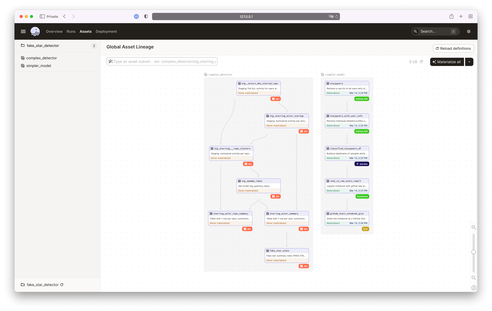
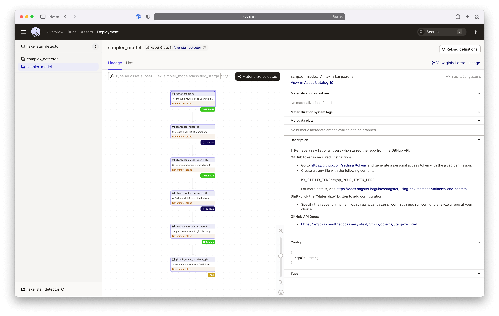
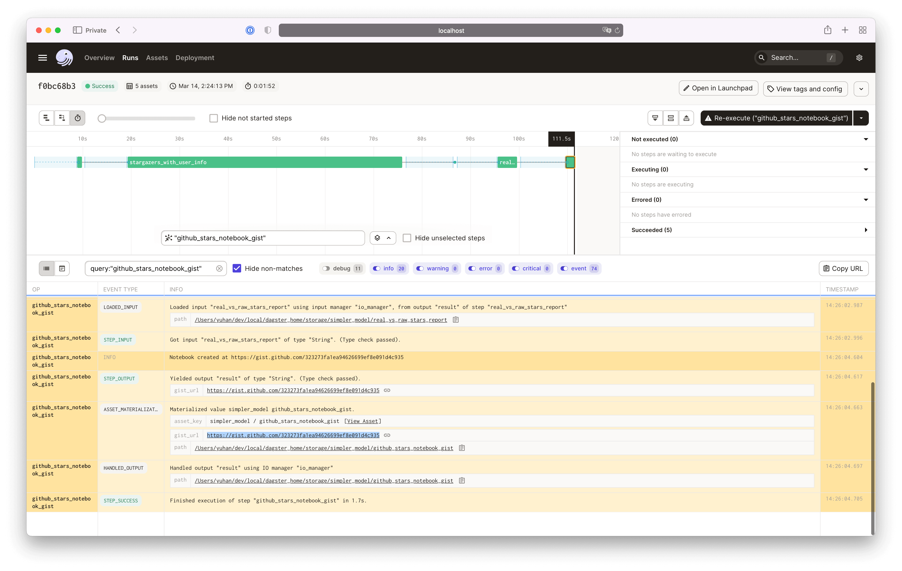
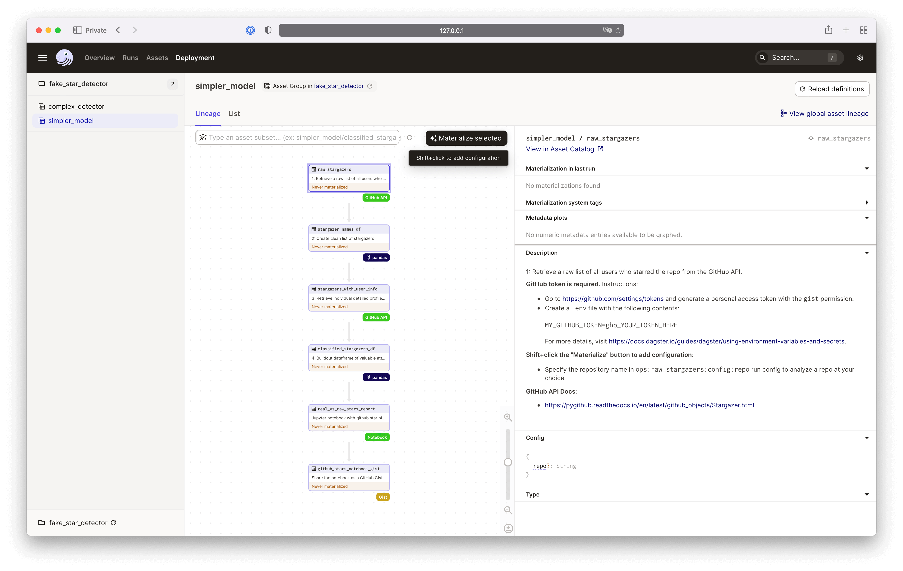
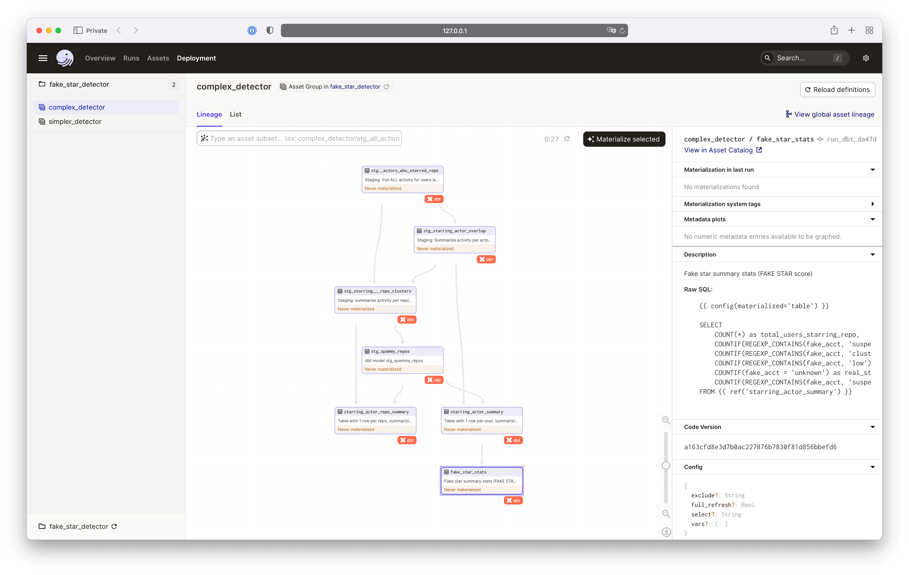
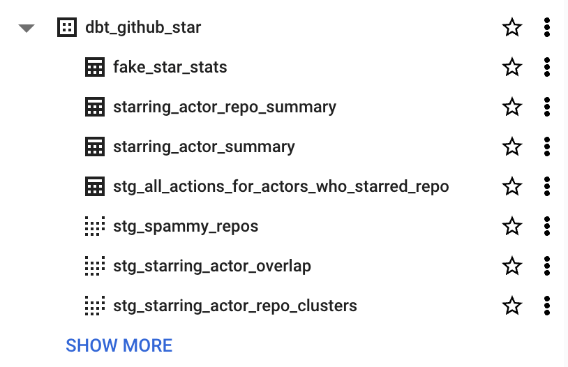
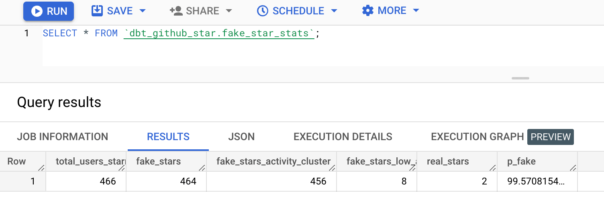

# fake-star-detector: A Dagster tutorial

This is a simple Dagster project to analyze the number of fake GitHub stars on any GitHub repository.  It is a companion to the blog post found [on the Dagster blog](https://dagster.io/blog/fake-stars).


This project consists of two models:
- [Simpler model](#trying-the-simpler-model-using-data-from-the-github-api): A simple model running “low activity” heuristic. This simple heuristic can detect many (but hardly all) suspected fake accounts that starred the same set of repositories, using nothing but data from the GitHub REST API (via [pygithub](https://github.com/PyGithub/PyGithub)).

- [Complex detector](#running-the-complex-model-using-bigquery-archive-data): An alternative detection model which runs a sophisticated clustering algorithm as well as the heuristic, using the public [GH Archive](https://www.gharchive.org) available in Bigquery. This model is written in SQL and uses [dbt](https://github.com/dbt-labs/dbt-core) alongside Dagster.
  * *Note: You can run this within the limits of a free-tier BQ account, but the analysis will be reduced in scope. By default, this model only scans data in 2023 on a small repository, in order to make it stay within the free-tier quota.*

<p align="center">
    
</p>

## Table of contents
- [Table of contents](#table-of-contents)
- [Getting started](#getting-started)
  - [Install instructions](#install-instructions)
    - [Getting GitHub Access Token for the simpler model](#getting-github-access-token-for-the-simpler-model)
    - [Creating Google Service Account for the complex model](#creating-google-service-account-for-the-complex-model)
  - [Setting up your local environment](#setting-up-your-local-environment)
    - [Cloning the repo](#cloning-the-repo)
  - [Building a virtual environment](#building-a-virtual-environment)
  - [Running Dagster locally](#running-dagster-locally)
- [Trying the simpler model using data from the GitHub API](#trying-the-simpler-model-using-data-from-the-github-api)
  - [Setting up the environment variables](#setting-up-the-environment-variables)
  - [Running the model](#running-the-model)
    - [Troubleshooting](#troubleshooting)
  - [Explanation of the model](#explanation-of-the-model)
- [Running the complex model using BigQuery archive data](#running-the-complex-model-using-bigquery-archive-data)
  - [Setting up the environment variables](#setting-up-the-environment-variables-1)
  - [Running the model](#running-the-model-1)
  - [Explanation of the model](#explanation-of-the-model-1)


## Getting started

### Install instructions

For this tutorial, we assume you have Git installed. Installation details can be found here: https://github.com/git-guides/install-git.

#### Getting GitHub Access Token for the simpler model
For running the [simpler model](#trying-the-simpler-model-using-data-from-the-github-api), you will also need a GitHub Personal Access token to access the GitHub API. This can be created in GitHub here: https://github.com/settings/tokens (after logging in to GitHub). Keep the new access token handy as we will be needing it shortly.

Note: we'll need `gist` scope because we're going to create a Gist to be the final report in the end.

#### Creating Google Service Account for the complex model

In order to run the complex model which uses BigQuery public archive data, you will need to have a BigQuery account to run the dbt models. You can sign up for a free account [here](https://cloud.google.com/bigquery). Check out [Create a Google Service Account](https://dagster.io/blog/dagster-google-sheets-tutorial#create-a-google-service-account) to learn how to create a service account and download the JSON key file. This also requires BigQuery API enabled in your service account.


### Setting up your local environment

#### Cloning the repo
You will need to pull a copy of this repository onto your local machine, go into the top level of the cloned repository and run the install command:

```commandline
git clone https://github.com/dagster-io/fake-star-detector.git
cd fake-star-detector
```

### Building a virtual environment

Install Dagster and our other dependencies - see https://docs.dagster.io/getting-started/install

```commandline
python3 -m venv venv
source venv/bin/activate

pip install -e ".[dev]"
```
*Note for M1 Mac users you may need to use `pip install dagster dagit --find-links=https://github.com/dagster-io/build-grpcio/wiki/Wheels`*

### Running Dagster locally


Start the Dagster UI web server:

```commandline
dagster dev
```

Open http://localhost:3000 with your browser to see the project.

*Note: If you have previously installed Dagster on your system, you may encounter the error `Error: No such command 'dev'.`. If this is the case, your system is likely trying to access the Dagster install outside of your venv. Try running the bash command `rehash` which will Recompute the internal hash table for the PATH variable, then repeat the `dagster dev` command.*

Next, you can run the detection model(s) of your own choice.

- Simple, more complete history, and no cost: [Simpler model](#trying-the-simpler-model-using-data-from-the-github-api) -- This model uses data from the GitHub API to detect fake stars. You may hit GitHub API limit depending on how many activities the repository you choose to analyze.
- Comprehensive, but shorter period at free-tier: [Complex model](#running-the-complex-model-using-bigquery-archive-data): This model uses the public [GH Archive](https://www.gharchive.org) available in Bigquery. You can specify a longer time span and a larger repository to analyze, but it may get expensive as you scan more data in BigQuery.


## Trying the simpler model using data from the GitHub API
### Setting up the environment variables

This model requires GitHub Access Token to access the GitHub API. Refer to the instructions [above](#getting-github-access-token-for-the-simpler-model) for how to obtain your own token.

Then, create a `.env` file at the root of the repository you just cloned and add your GitHub access token as a variable:

```
GITHUB_ACCESS_TOKEN=<<GITHUB_ACCESS_TOKEN>>
```

### Running the model

<p align="center">
    
</p>

Navigate to `simpler_model` from the left nav in the UI. This defaults to analyze a small repository `frasermarlow/tap-bls`. You can click "Materialize all" to kick off the model and check out the result. At the end of the job, it will output a Gist summarizing the analysis, such as [this URL](https://gist.github.com/yuhan/3ff6b81e9599cadf51afd6e485927f22). You can find the link in the compute log:

<p align="center">
    
</p>

You can also specify a different repo by Shift+clicking "Materialize all" on the asset graph page to specify it in the configuration, such as:

```yaml
ops:
    raw_stargazers:
        config:
            repo: <insert name of the repo to analyze>
```

Shift+click "Materialize all"            |  Config editor
:-------------------------:|:-------------------------:
  |  

Then, click "Materialize" to kick off the simple model. In the end, you'll get a GitHub Gist with the results.


#### Troubleshooting

If you are using the default Dagster storage backed by SQLite, you may encounter an error as:
```
sqlalchemy.exc.OperationalError: (sqlite3.OperationalError) unable to open database file
```

To get your pipeline successfully running, you can Shift+click "Materialize all" on the asset graph page and add the following configuration. This will turn off the default multiprocessing execution.

```yaml
execution:
  config:
    in_process: null
```


### Explanation of the model

This asset group is a Dagster project and involves 6 assets:

1) Asset `stargazers`: We call the GitHub API and retrieve a list of users who have starred the repo, and then turn the response into a Pandas DataFrame.
2) Asset `stargazers_with_user_info`: We look up each user in turn and pull their detailed profile from the GitHub API.
3) Asset `classified_stargazers_df`: We analyze each profile and match it against our heuristic to determine if they are fake or not, and output a Pandas DataFrame.
4) Asset `real_vs_raw_stars_report`: We calculate the percentage of fake stars and output a report in raw Jupyter Notebook format.
5) Asset `github_stars_notebook_gist`: We convert the raw Jupyter Notebook into a Gist and output the URL to the Gist.

In addition to the above, we have a few helper functions:

a) `validate_star`: Matching a profile against the heuristic
b) `see_if_user_exists`: Verifying that a user still exists before pulling the full details
c) `handle_exception`: Handling exceptions for the GitHub API call.  This op calls on `get_retry_at` which returns the `x-ratelimit-reset`value for the GitHub API.

Currently, the pipeline will simply return a result in the Dagster UI as in `INFO` event type such as "Score is 12.34% fake stars" and will provide a list of usernames flagged as fake.

## Running the complex model using BigQuery archive data

This model is written in SQL and uses dbt. You can find the dbt project in the [`dbt_project`](./dbt_project/) directory, and the dbt models in the [`dbt_project/models/complex_detector/`](./dbt_project/models/complex_detector/) directory.

### Setting up the environment variables


This model requires a BigQuery account and Google Search Account with BigQuery API enabled to access the source data. Refer to [the above](#creating-google-service-account-for-the-complex-model) for instructions.

Next, you will need to add the credentials to your environment. You can do this by adding the following to your `.env` file:

```
DBT_BIGQUERY_KEYFILE_PATH='path to your JSON key file'
DBT_BIGQUERY_PROJECT='name of the bigquery project the output will write to'
DBT_BIGQUERY_DATASET='dbt_github_star' # or your desired bigquery dataset name
DBT_BIGQUERY_LOCATION='US' # or your desired location
```


### Running the model

Navigate to `complex_detector` in the UI. Click "Materialize all" to kick off the complex model. This defaults to analyze `frasermarlow/tap-bls`.

<p align="center">
    
</p>

In the end, you'll get a few BigQuery tables with the final result:

Tables and views in BigQuery           |  Final result
:-------------------------:|:-------------------------:
  |  


To check out for another repository, edit the "target_repo" in [`./dbt_project/models/fake_star_detector/stg_all_actions_for_actors_who_starred_repo.sql`](./dbt_project/models/complex_detector/stg_all_actions_for_actors_who_starred_repo.sql):
```

```


### Explanation of the model

This loads a dbt project which uses GitHub Archive data to identify suspicious users who starred the given repository, and estimates a FAKE STAR score for that repository using two separate heuristics
to catch different types of fake accounts.

The dbt project materializes 4 BigQuery tables with estimated FAKE STAR score, and a few staging views:
1. `stg_all_actions_for_actors_who_starred_repo`: all activity for users who starred repo in the given time period
2. `starring_actor_summary`: table with 1 row per user, summarizing similarity to other users in a set.
3. `starring_actor_repo_summary`: table with 1 row per repo, summarizing similarity to other repositories actors touched.
4. `fake_star_stats`: fake star summary stats (FAKE STAR score).
